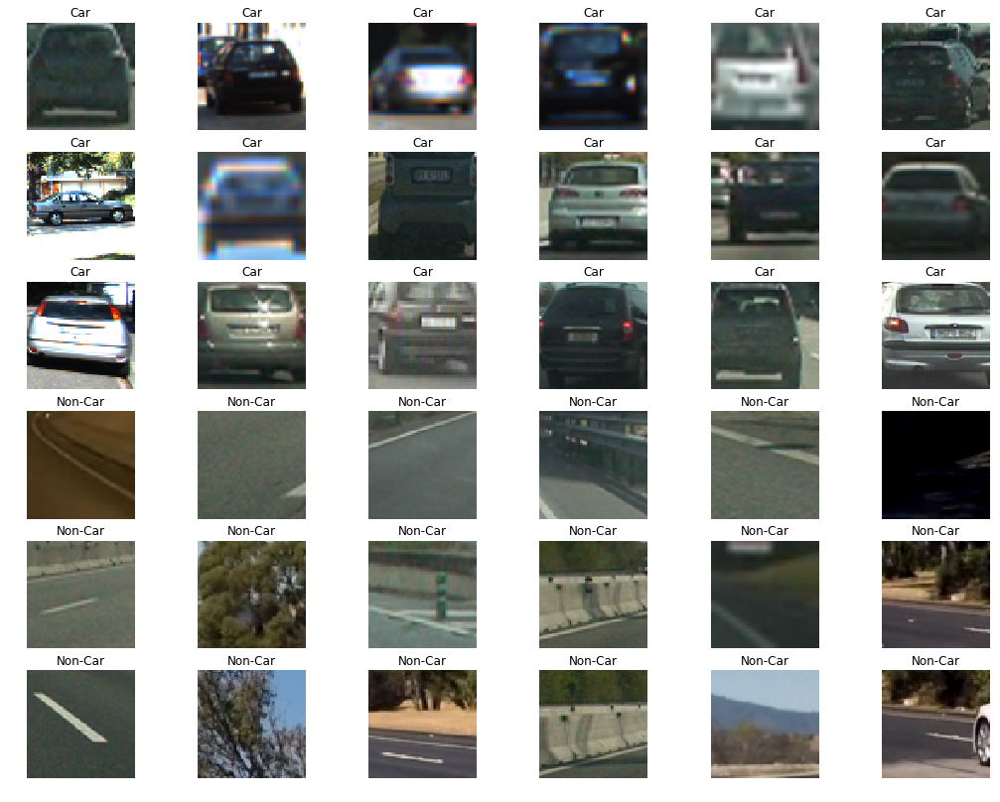
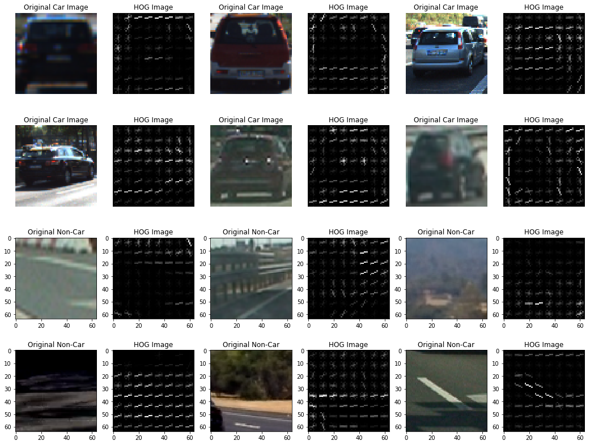
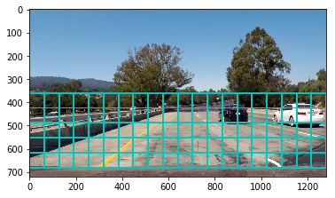
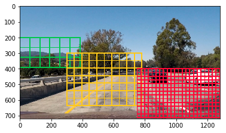
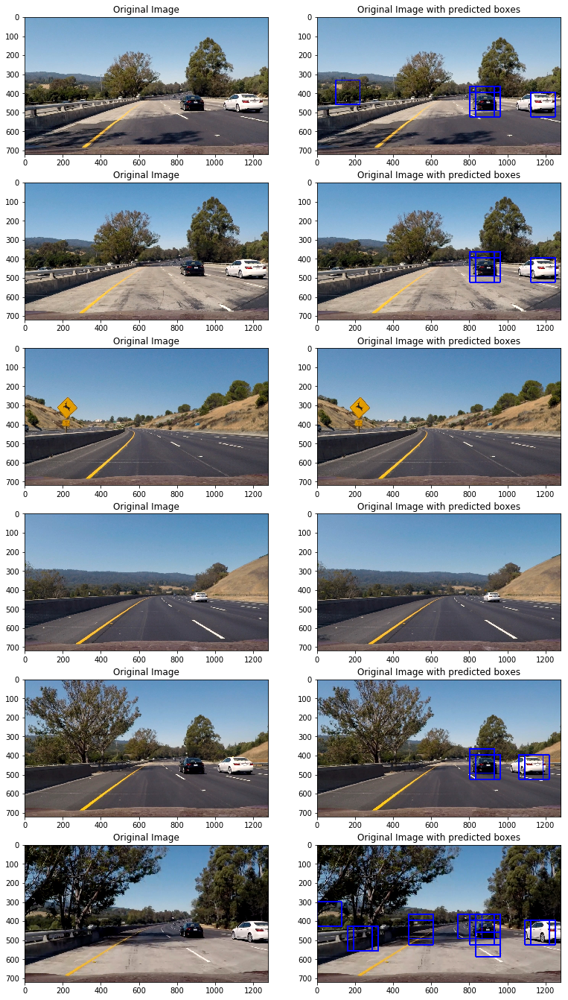
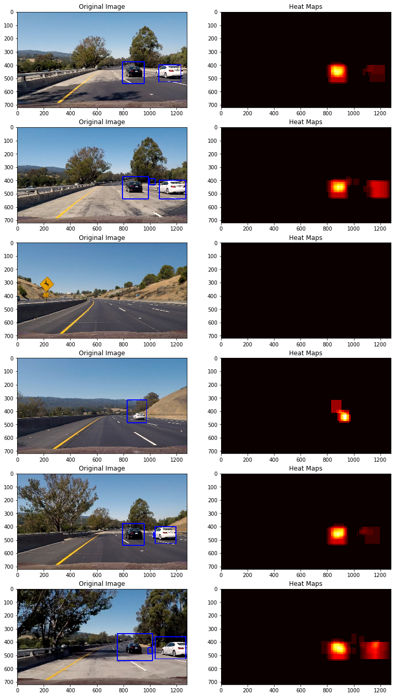

# Vehicle Detection

In this project, my goal was to write a software pipeline to detect vehicles in a video using Machine Learning.

The Project
---

The goals / steps of this project were the following:
* **Data Visualization:** Like any Machine Learning problem, first step was to visualize my data. For this project, I obtained data from different sources (mentioned below). A visualization of vehicles and non-vehicles classes looked like this:

* Next, I performed a **Histogram of Oriented Gradients (HOG)** feature extraction along with applying a **color transform** and **append binned color featuresand histograms of color** on a labeled training set of images. HOG Feature extraction allows visualization of predominant features/ patterns specific to cars, here is an image showing results of my HOG feature extraction applied to some vehicle and non-vehicle images:

* Next, I split my data into training and test set (80%-20% ratio) and trained a classifier Linear SVM classifier. I randomly shuffled my data and normalized the X values, followed by comparing accuracies with various hyperparameters (for ex. pix_per_cell, cell_per_block, spatial_size etc.) and with the end values I chose, I obtained training and test accuracies of 100% and 99.2% respectivelly.

* After obtaining a classifier with a great accuracy, I implemented a sliding-window technique to search for vehicles in images. First I implemented OpenCV's rectangle drawing function to draw rectangles at desired locations as shown in the below figure:

* With functionality to change the size of my rectangles, here is the same image from above visualized with rectangles of different sizes drawn on top of it:

* I wrote a function that would draw rectangle only where my classifier would predict a value of 1, this gave me this result for all my test images: (There were a few images provided to us for testing our algorithm as part of this project)

* From the above figure, it can be seen that there are many false positives in the image (wrongly detected images) and there are also images which have been detected multiple times, (by same-sized rectangular window drawn at different locations in the image). In order to aliveate this problem, I used heatmaps with a threshold. What it means is that if an image is detected multiple times, it is "heated" and then end location chosen is the centroid of all the points obtained for the same image. On the other hand, a false positive would become "cold", and we can thereby ignore it. A heat map for the same image set is shown below:

* After getting satisfactory results on images, I ran my pipeline on a video stream and created a heat map of recurring detections frame by frame to reject outliers and follow detected vehicles. You can check the resultant video [here](./test_videos_output/ProjectVideoOutput.mp4)

* Once I had a working pipeline for vehicle detection, I added my lane-finding algorithm from the last project to do simultaneous lane-finding and vehicle detection!

---
Here are links to the labeled data for [vehicle](https://s3.amazonaws.com/udacity-sdc/Vehicle_Tracking/vehicles.zip) and [non-vehicle](https://s3.amazonaws.com/udacity-sdc/Vehicle_Tracking/non-vehicles.zip) examples that I used for training my classifier.  These example images come from a combination of the [GTI vehicle image database](http://www.gti.ssr.upm.es/data/Vehicle_database.html), the [KITTI vision benchmark suite](http://www.cvlibs.net/datasets/kitti/), and examples extracted from the project video itself.
